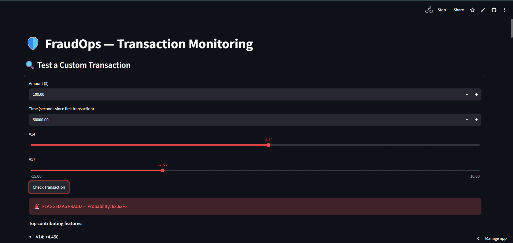
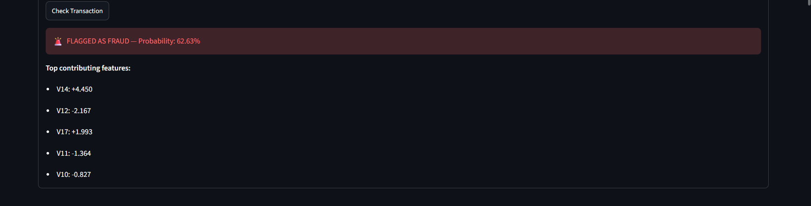
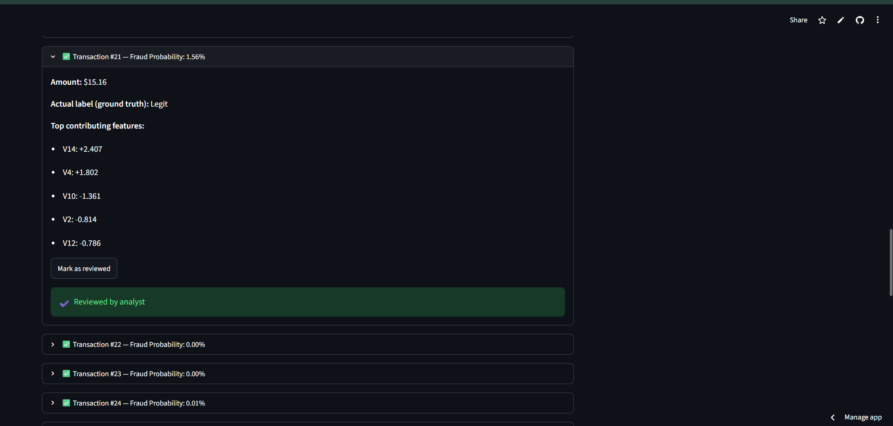
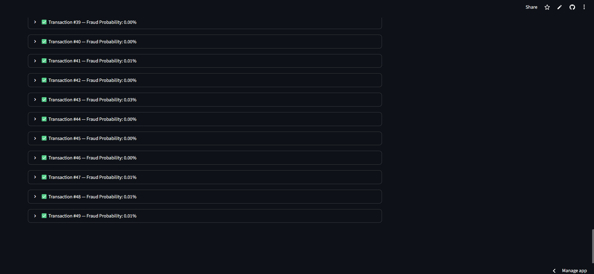

# 🛡️ FraudOps — End-to-End Fraud Detection System

A production-style fraud detection pipeline that goes beyond a notebook: trained model, cost-aware decision logic, explainability, a live API, and an analyst-facing dashboard — all deployed and publicly accessible.

**Live Demo:** https://fraudops-detection-shap.streamlit.app/
**API Docs:** https://fraudops-api.onrender.com/docs

> Note: the API is hosted on a free tier that sleeps after ~15 min of inactivity. The first request after idle time may take 30-50 seconds to respond while it wakes up.

<p align="center">
  
  
</p>
---

## Problem

Credit card fraud detection is a classic but genuinely hard ML problem: fraud makes up **0.17%** of transactions, meaning a naive model can hit 99.8% accuracy while catching zero fraud. This project treats it the way a real fraud team would — optimizing for the right metric, the right decision threshold, and explainability, not just accuracy.

Dataset: [Kaggle Credit Card Fraud Detection](https://www.kaggle.com/datasets/mlg-ulb/creditcardfraud) (284,807 transactions, 492 fraud, PCA-anonymized features).

---

## Architecture

```
creditcard.csv
      |
      v
[ train.py ]
  - time-based train/val/test split
  - SMOTE oversampling (train only)
  - XGBoost classifier
  - cost-matrix threshold selection
  - SHAP explainer
      |
      v
fraud_model.joblib, threshold.joblib
      |
      v
[ api.py -- FastAPI ]  --deployed on Render-->  https://fraudops-api.onrender.com
      |
      v
[ dashboard.py -- Streamlit ]  --deployed on Streamlit Cloud-->  live dashboard
```

---

## Key Design Decisions

**1. Time-based split, not random shuffle**
Transactions are sorted by `Time` and split 70/15/15 into train/val/test. A random split would leak future transaction patterns into training — unrealistic, since in production a model only ever has the past to learn from.

**2. PR-AUC as the primary metric, not accuracy**
With a 0.17% fraud rate, accuracy is meaningless. PR-AUC and per-class precision/recall on the fraud class are what actually reflect model quality here.

**3. SMOTE for imbalance, applied only to training data**
SMOTE oversamples the minority class by interpolating between real fraud examples (not just duplicating them), bringing fraud up to 10% of the training set — a level chosen to avoid overfitting to synthetic patterns. Validation and test sets are left in their real, untouched distribution, since evaluating on synthetic data would be misleading.

**4. Cost-aware threshold selection**
Rather than using the default 0.5 cutoff, the decision threshold is chosen by minimizing an estimated dollar cost, where a missed fraud case (false negative) is weighted as ~25x more costly than a false alarm (false positive) — reflecting how real fraud teams reason about the tradeoff.

**5. SHAP for per-transaction explainability**
Every flagged transaction comes with its top contributing features, so a decision can be justified — useful for compliance, audits, or explaining a decline to a customer.

---

## Results (held-out test set — never used for training or tuning)

| Metric | Value |
|---|---|
| PR-AUC | 0.78 |
| Precision (fraud class) | 63% |
| Recall (fraud class) | 75% |
| Threshold used | 0.3777 |

---

## The Dashboard

- **Live transaction tester** — manually enter transaction details (amount, time, and the two most SHAP-influential features) and get an instant fraud probability + explanation
- **Held-out transaction feed** — 50 real transactions from the test set, each showing the model's prediction, probability, ground truth label, and SHAP explanation
- **Analyst review workflow** — mark transactions as reviewed (session-based; not persisted to a database in this demo — see Limitations)

<p align="center">
  
  
</p>

---

## Tech Stack

- **Modeling:** XGBoost, imbalanced-learn (SMOTE), SHAP, scikit-learn
- **Serving:** FastAPI, Pydantic
- **Frontend:** Streamlit
- **Deployment:** Render (API), Streamlit Community Cloud (dashboard)

---

## Limitations (honest, on purpose)

- Free-tier hosting: the API sleeps after inactivity and has limited memory
- "Reviewed" status in the dashboard is stored in-memory per session, not a real database — in production this would persist to something like Postgres so review state survives across sessions and multiple analysts
- PCA-anonymized features (V1-V28) mean SHAP explanations point to abstract components rather than human-readable transaction attributes — in a real deployment with raw features, explanations would be directly interpretable (e.g. "unusual merchant category" instead of "V14")

---

## Run It Locally

```bash
git clone https://github.com/aathif-gh/fraudops-detection-shap.git
cd fraudops-detection-shap
python -m venv venv
venv\Scripts\activate       # Windows
pip install -r requirements.txt

# Train (requires creditcard.csv from Kaggle, placed in this folder)
python train.py

# Run the API
uvicorn api:app --reload

# In a separate terminal, run the dashboard
streamlit run dashboard.py
```
